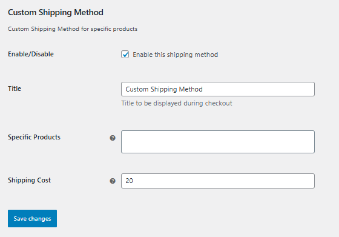
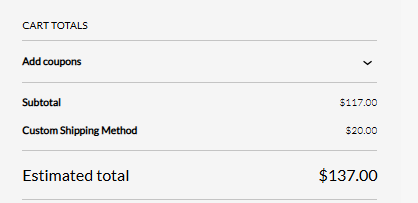

# 🚚 WooCommerce Custom Shipping Method

A custom WooCommerce shipping plugin that allows you to define a **shipping method for specific products** and automatically hide other shipping options.

---

## ✨ Features

- 🚚 Custom shipping method for selected products
- 🎯 Apply shipping only to specific products
- 🔒 Hide other shipping methods dynamically
- ⚙️ Admin settings with product selection (Select2)
- ⚡ Optimized with caching (transients)

---

## 🛠️ Tech Stack

- PHP (WordPress Plugin Development)
- WooCommerce Shipping API
- jQuery + Select2

---

## 📸 Screenshots

### Admin Page

### Checkout Page

---

## ⚙️ Installation

1. Upload plugin to:
/wp-content/plugins/woocommerce-custom-shipping-method
2. Activate plugin
3. Go to:
WooCommerce → Settings → Shipping
4. Configure the method and select products

---

## 🧠 How It Works

- Admin selects specific products
- If cart contains those products:
- Only custom shipping is shown
- Otherwise:
- Custom shipping is hidden

---

## 📂 Structure
woocommerce-custom-shipping-method/
│
├── woocommerce-custom-shipping-method.php
├── assets/
│ └── js/
│ └── select2-init.js
└── README.md

---

## 👨‍💻 Author

Muhammad Faisal  
Full Stack Developer (Laravel & WordPress)

---

## ⭐ Support

If you like this project, give it a ⭐ on GitHub!
